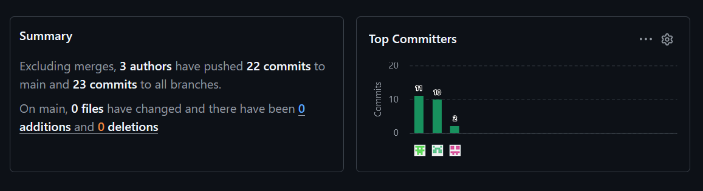
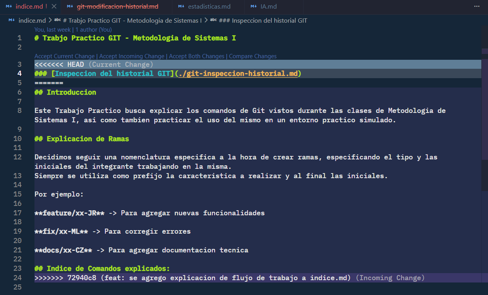
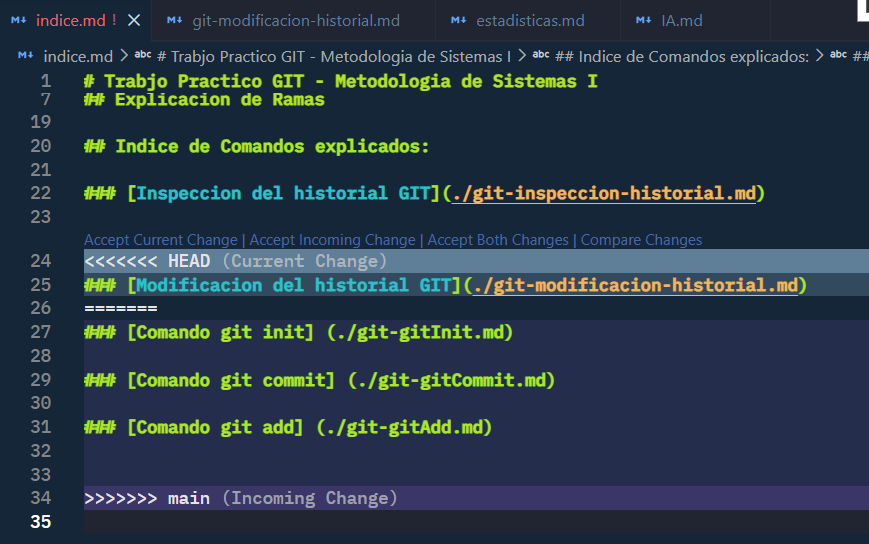

# Estadisticas

## Mayor cantidad de Commits:

En la captura se observa del lado izquierdo la cantidad total de commits en el repositorio, y del lado derecho la cantidad de commits por integrante.

## Cantidad total de Merges realizados:

## Cantidad de conflictos producidos:

## Cantidad de ramas existentes:

## Commit con la mayor cantidad de archivos modificados:

## Captura de conflicto previo a su resolucion:

Este conflicto surgio en la rama **feature/git-modificacion-historial-JR** al abrir una Pull Request de merge a main, donde el indice.md ya tenia toda la explicacion e introduccion previa.
Para resolverlo se utilizo el comando **git rebase** y el hash del commit asociado es: **c572c3a4ee6f94e522e8ab4fc5c9c95b83f8d032**

Este conflicto surgio en la rama **feature/git-modificacion-historial-JR** al abrir una Pull Request de merge a main, donde el indice.md contaba con referencias a archivos explicativos no contemplados en esta rama.
Para resolverlo se utilizo el comando **git merge** y el hash del commit asociado es: **98f0fc919288c6707c4afd3a4e6acbc6b3703d87**
